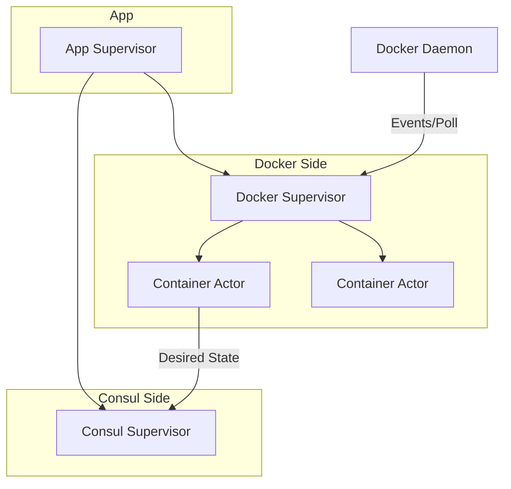

# Emissary

Emissary is a high-performance, idiomatic Rust service discovery bridge between Docker and Consul. It monitors Docker containers and registers them as services in Consul based on labels.

## Architecture

The project follows a controller-based actor model implemented using `actix`.

### Actor Responsibilities

- **App Supervisor**: The root supervisor that manages the lifecycle of the Docker and Consul subsystems.
- **Docker Supervisor**: 
    - Subscribes to Docker events (start, stop, etc.).
    - Performs periodic full-state polling (anti-entropy).
    - Manages a `Container Actor` for each container with valid Emissary labels.
- **Container Actor**: Represents the state and lifecycle of a specific service discovered from Docker.
- **Consul Supervisor**: Manages the registration and heartbeating of services in Consul.

## Features

- **Event-Driven**: Immediate response to Docker container lifecycle events.
- **Anti-Entropy**: 15-minute polling interval to ensure consistency.
- **Resilient**: Bounded queues (256 events) and automatic reconnection logic.
- **Safe**: Written in Rust with a focus on reliability and observability.
