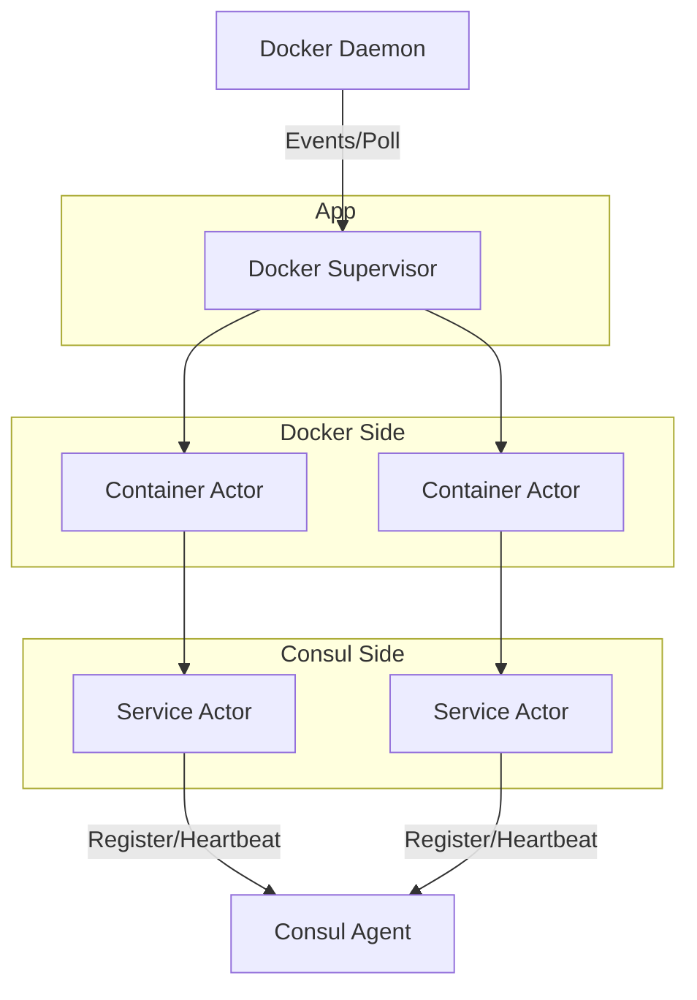

# Emissary

Emissary bridges the gap between Docker and Consul by automatically registering and deregistering services based on
container lifecycle events. Written in Rust, Emissary is designed to be highly performant and resilient.

## Features

- **Label Driven:** The service definition lives with your containers, define your Consul services using Docker labels.
- **Event-Based Lifecycle:** Designed to minimize the Docker daemon and Consul agent load, Emissary uses subscriptions
  when possible and automatically registers and deregisters services.
- **Anti-Entropy:** Ensures consistency by periodically syncing with Docker and Consul, even under heavy load or
  networking issues.
- **Lightweight:** Written in Rust, Emissary benefits from native performance and low resource usage.

## Architecture

The project follows a controller-based actor model implemented using `actix`.

